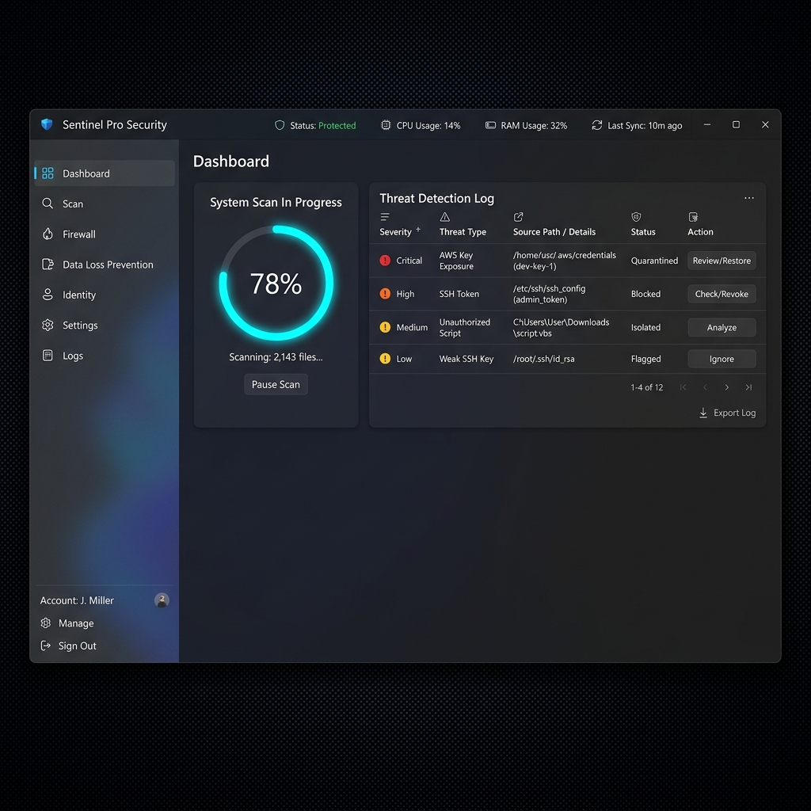

# Guía de la Interfaz Gráfica (GUI) 🎨

Data-Shield cuenta con una interfaz moderna basada en **Fluent Design** de Windows 11, diseñada para ofrecer una experiencia premium y profesional de seguridad.

## 🚀 Inicio Rápido
Para lanzar la interfaz gráfica, simplemente ejecuta:
```bash
# Asegúrate de tener las dependencias de la GUI instaladas
pip install -e ".[gui]"

# Lanzar la interfaz
python -m datashield --gui
```

## 📋 Características Principales

### 1. Monitor de Recursos (Título)
La barra de título dinámica muestra en tiempo real:
- **CPU**: Uso de procesador.
- **RAM**: Consumo de memoria.
- **GPU**: Carga de la tarjeta gráfica (si está disponible).
- **Resolución**: Dimensiones actuales de la ventana.

### 2. Navegación Lateral
Utiliza la barra lateral para moverte entre los diferentes módulos:
- 🔍 **Scanner**: Panel principal para buscar credenciales.
- 🔐 **Vault**: Gestión de archivos cifrados y caja fuerte.
- 👤 **Monitor**: Seguimiento en tiempo real de cambios en el sistema.
- ⚙️ **Settings**: Configuración de hilos, exclusiones y preferencias.

### 3. Persistencia Inteligente
La aplicación recuerda automáticamente:
- El tamaño y posición de la ventana.
- Tus carpetas excluidas de escaneo.
- El número de hilos de procesamiento preferido.

## 📸 Capturas de Pantalla

### Panel de Escaneo

*Interfaz limpia con barra de progreso estilizada y tabla de resultados con niveles de riesgo.*

## ⚙️ Configuración Avanzada
En el panel de **Settings**, puedes ajustar el rendimiento:
- **Max Threads**: Aumenta para escaneos más rápidos en CPUs multi-core.
- **Exclusions**: Añade carpetas separadas por comas que no deseas analizar (ej: node_modules, .git).

---
*Estado actual: v0.1.0 (Fluent UI Migrated)*
